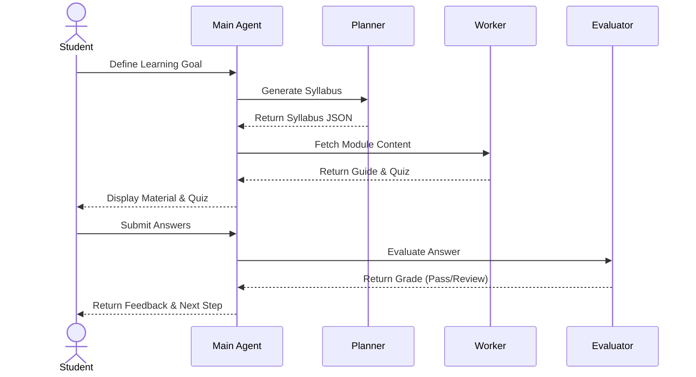

# FocusFlow AI 🎓
> **Smart Multi-Agent Learning Companion**

FocusFlow AI is an adaptive, multi-agent educational system designed to help self-directed students master complex subjects through personalized study plans, customized guides, and real-time active assessment.

---

## 🌟 Key Features
- **Planner Agent**: Assesses user goals and dynamically designs a structured, modular syllabus.
- **Worker Agent**: Generates bite-sized explanations, search-assisted context, and custom quizzes for the active module.
- **Evaluator Agent**: Evaluates user quiz submissions, provides constructive feedback, and decides whether the student advances or reviews.
- **Session Memory**: JSON-backed local storage to persist learning history, progress, and syllabus details.
- **Interactive UI**: Built with Gradio, allowing simple deployment on Hugging Face Spaces or local servers.
- **Observability**: Structured execution logs to trace agent-to-agent operations and token actions.

---

## 📂 Project Structure
```text
project/
├── agents/
│   ├── planner.py            # PlannerAgent: designs modules
│   ├── worker.py             # WorkerAgent: generates study material & quizzes
│   └── evaluator.py          # EvaluatorAgent: grades quiz answers
├── tools/
│   └── tools.py              # Mock search & utilities
├── memory/
│   └── session_memory.py     # Persistent memory storage
├── core/
│   ├── context_engineering.py# Prompt systems & system templates
│   ├── observability.py      # Execution logger
│   └── a2a_protocol.py       # Message protocols
├── main_agent.py             # Orchestrator routing inputs
├── app.py                    # Gradio Web Interface
├── run_demo.py               # Command-line testing script
└── requirements.txt          # Package requirements
```

---

## ⚙️ Installation & Usage

### 1. Clone the repository
```bash
git clone https://github.com/yourusername/focusflow-ai.git
cd focusflow-ai
```

### 2. Install dependencies
```bash
pip install -r project/requirements.txt
```

### 3. Run Command-Line Demo
Verify the agent flow quickly via the terminal:
```bash
python project/run_demo.py
```

### 4. Run Interactive Web UI
Launch the interactive chat interface:
```bash
python project/app.py
```

---

## 🔄 Multi-Agent Workflow


---

## 📄 License
This project is open-source and licensed under the MIT License.


